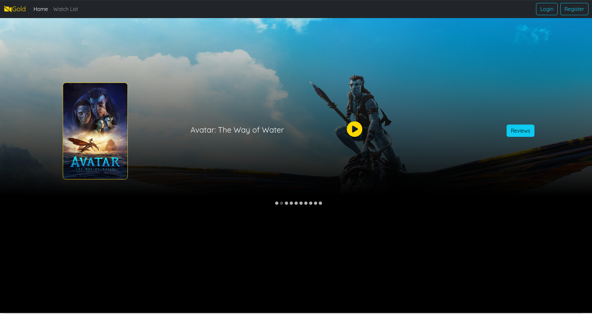
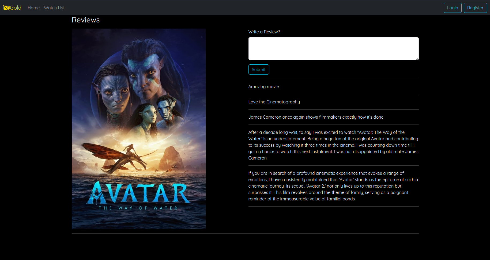
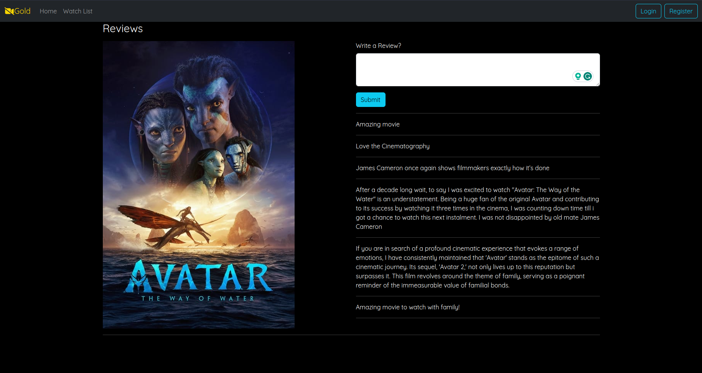
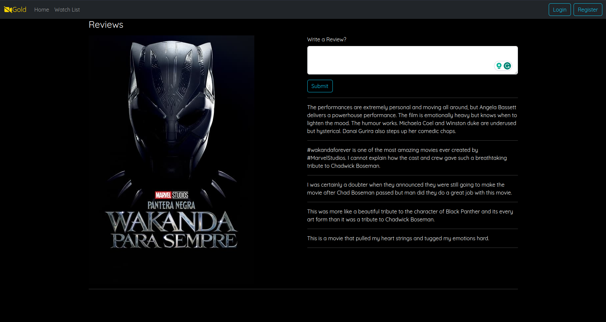

Commands to run:
1. Run the SpringBoot application 
2. Start the React App 

```
cd Frontend
npm install
npm start
```

<h1>Home page:</h1>

<h1>Reviews page:</h1>

<h1>Adding review:</h1>


<h1>Home page carousel:</h1>

<h1>Review page:</h1>
